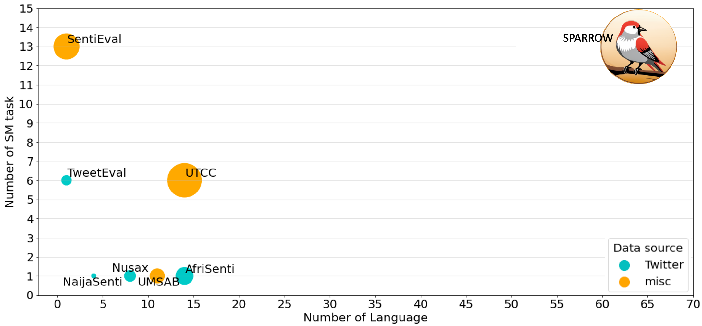
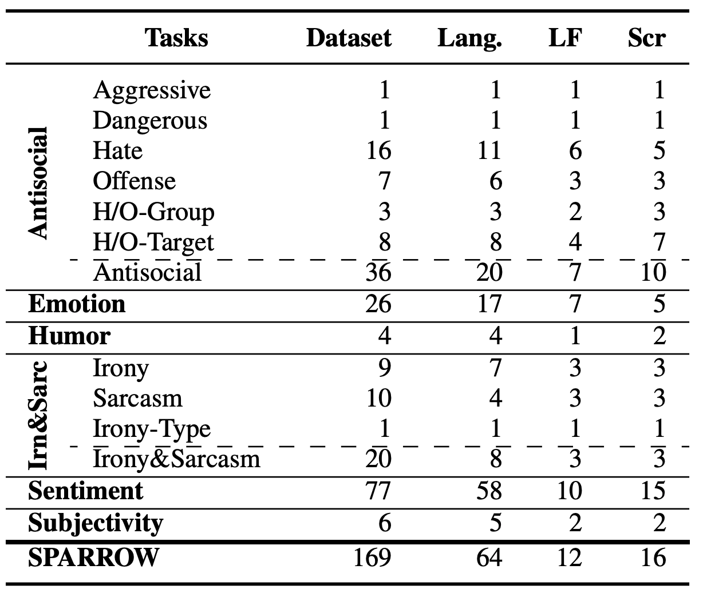

# The Skipped Beat: A Study of Sociopragmatic Understanding in LLMs for 64 Languages

 <a href="https://chiyuzhang94.github.io/" target="_blank">Chiyu Zhang</a>, Khai Duy Doan, Qisheng Liao, <a href="https://mageed.arts.ubc.ca/" target="_blank">Muhammad Abdul-Mageed</a>

  
  

Publish at Main Conference of EMNLP 2023

    

Comparison of SM benchmarks with leaderboards. SPARROW is an evaluation benchmark for sociopragmatic meaning understanding. SPARROW comprises 169 datasets covering 13 task types across six primary categories (e.g., anti-social language detection, emotion recognition). SPARROW datasets encompass 64 different languages originating from 12 language families representing 16 writing scripts.

  

    

Summary of datasets in SPARROW. Lang: number of languages, LF: number of language families, Scr: number of scripts.

## Benchmark and Leaderboard
Thanks for being interested in your work. We are currently working on the leaderboard and plan to release the benchmark soon. If you would like to be notified when the leaderboard is ready, please fill out [this form]() and we will send you an email.
